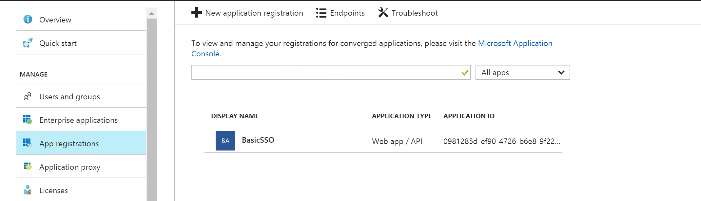
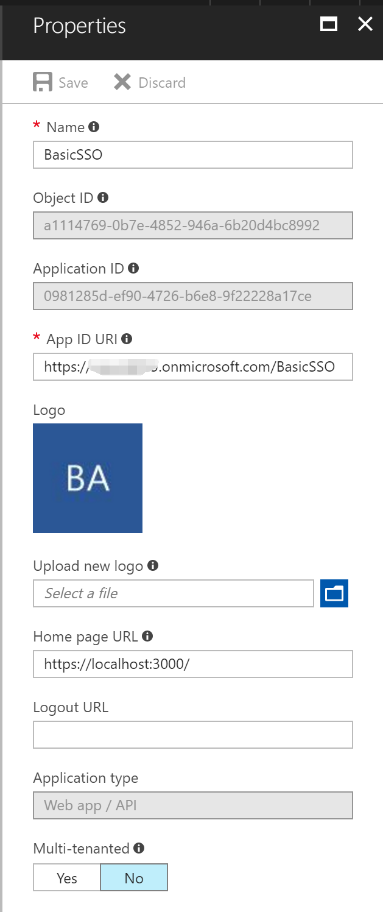
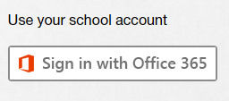

# Basic SSO - Ruby version

In this sample we show you how to integrate Azure Active Directory(Azure AD) to provide secure sign in and authorization. 

The code in the following sections is part of the full featured Ruby app and presented as a new project for clarity and separation of functionality.

**Table of contents**
* [Prerequisites](#prerequisites)
* [Build and deploy the Starter Project](#build-and -deploy-the-starter-project)
* [Add O365 Single Sign On to the starter project](#add-o365-single-sign-on-to-the-starter-project)


## Prerequisites

- [Visual Studio Code](https://code.visualstudio.com/Download).

- The [Ruby](https://www.ruby-lang.org/en/downloads) language version 2.2.2 or newer.

- The [RubyGems](https://rubygems.org/) packaging system, which is installed with Ruby by default. To learn more about RubyGems, please read the [RubyGems Guides](http://guides.rubygems.org/).

- The [Rails](http://rubyonrails.org/) web application development framework, version 5.0.0 or above

- A working installation of the [SQLite3 Database](https://www.sqlite.org/).

  ​

# Build and deploy the Starter Project

The starter project is a simple application with only SQL authentication configured. By updating this project, you can see how to integrate O365 Single Sign On to an application with existing authentication.

1. Open a terminal, navigate to **Starter Project** directory. Execute the command below:

   ```command
   bundle install
   rails db:schema:load
   rails db:seed
   rails s
   ```

2. Open [http://localhost:3000](http://localhost:3000/) in a browser.

3. Click the Register link to register as a user.

   

4. Complete the form to add a user.

   

5. Once registered, you should see a blank page.

   


# Add O365 Single Sign On to the starter project

Follow these instructions to add SSO functionality to the starter project application. You will need to configure your app in Azure, create files and copy and paste code from the instructions.

All code referenced in these instructions is also used in the associated files in the [Demo App](../../../)

## Register the application in Azure Active Directory

1. Sign in to the Azure portal: [https://portal.azure.com/](https://portal.azure.com/).

2. Choose your Azure AD tenant by selecting your account in the top right corner of the page.

3. Click **Azure Active Directory** -> **App registrations** -> **+Add**.

4. Input a **Name**, and select **Web app / API** as **Application Type**.

   Input **Sign-on URL**: https://localhost:44377/

   

   Click **Create**.

5. Once completed, the app will show in the list.

   

6. Click it to view its details. 

   

7. Click **All settings**, if the setting window did not show.

     

     Copy aside **Application ID**, then Click **Save**.

   * Click **Reply URLs**, add the following URL into it.

     [http://localhost:3000/auth/azure_oauth2/callback](http://localhost:3000/auth/azure_oauth2/callback)

   * Click **Required permissions**. Add the following permissions:

     | API                            | Application Permissions | Delegated Permissions         |
     | ------------------------------ | ----------------------- | ----------------------------- |
     | Windows Azure Active Directory |                         | Sign in and read user profile |

     

   * Click **Keys**, then add a new key

     

     Click **Save**, then copy aside the **VALUE** of the key. 

   Close the Settings window.

## Add Single Sign On

1.  Open the Starter Project in Visual Studio Code, if it isn't already open. 

2. Open **Gemfile** file, find `gem 'httparty'` , add the following packages under  `gem 'httparty'` .

   ```Ruby
   gem 'microsoft_graph'
   gem 'adal'
   gem 'openid_connect'
   gem 'omniauth-oauth2'
   ```

3. Open **db/schema.rb** , add the following code into **ActiveRecord** to create token cache table.

   ```ruby
     create_table "token_caches", force: :cascade do |t|
       t.datetime "created_at",                     null: false
       t.datetime "updated_at",                     null: false
       t.string   "o365_userId"
       t.text     "refresh_token"
       t.text     "access_tokens"
     end
   ```

   To see how this file works in the Demo app, refer to the file located [here](../db/schema.rb) in the Demo app.

4. Add new file named **token_cache.rb** into **app/models** folder, add the following code into it to create token cache model.

   ```ruby
   class TokenCache < ApplicationRecord
   end
   ```

   To see how this file works in the Demo app, refer to the file located [here](../app/models/token_cache.rb) in the Demo app.

5. Add new file named **token_service.rb** into **app/services** folder, add the following code into it.

   ```ruby
   class TokenService
       
     def initialize()
     end

     def cache_tokens(o365_user_id, resource, refresh_token, access_token, jwt_exp)
       cache = TokenCache.find_or_create_by(o365_userId: o365_user_id)
       cache.refresh_token = refresh_token
       access_tokens = cache.access_tokens ? JSON.parse(cache.access_tokens) : {}
       access_tokens[resource] = { 
         expiresOn: get_expires_on(jwt_exp), 
         value: access_token 
       }
       cache.access_tokens = access_tokens.to_json();
       cache.save();
     end

     def get_access_token(o365_user_id, resource)
       cache = TokenCache.find_by_o365_userId(o365_user_id)
       if !cache
         raise Exceptions::RefreshTokenError
       end
       # parse access_tokens
       access_tokens = JSON.parse(cache.access_tokens)
       access_token = access_tokens[resource]
       if access_token
         expires_on = DateTime.parse(access_token['expiresOn'])
         utc_now = DateTime.now.new_offset(0)
         if utc_now < expires_on - 5.0 / 60 / 24
           return access_token['value']
         end
       end
       # refresh token and cache
       auth_result = refresh_token(cache.refresh_token, resource)
       access_tokens[resource] = { 
         expiresOn: get_expires_on(auth_result.expires_on), 
         value: auth_result.access_token }
       cache.access_tokens = access_tokens.to_json()
       cache.refresh_token = auth_result.refresh_token
       cache.save()
       #
       return auth_result.access_token;
     end

     def clear_token_cache
       caches = TokenCache.all();
       caches.each do |cache|
         cache.destroy()
       end
     end

     private def refresh_token(refresh_token, resource)
   		authentication_context = ADAL::AuthenticationContext.new
   		client_credential = ADAL::ClientCredential.new(Settings.AAD.ClientId, Settings.AAD.ClientSecret)
       begin
          authentication_context.acquire_token_with_refresh_token(refresh_token, client_credential, resource)
       rescue
         raise Exceptions::RefreshTokenError
       end
     end

     private def get_expires_on(jwt_exp)
       return DateTime.new(1970, 1, 1) + jwt_exp * 1.0 / (60 * 60 * 24)
     end

   end
   ```

   This code  is used to store access and refresh tokens. To see how this file works in the Demo app, refer to the file located [here](../app/services/token_service.rb) in the Demo app.

6. Open **config/settings.yml** file, add the following code to the bottom of file.

   ```ruby
   AAD:
     ClientId: <%= ENV['ClientId'] %>
     ClientSecret: <%= ENV['ClientSecret'] %>
   ```

   This code  is used to configure ClientId/ClientSecret. To see how this file works in the Demo app, refer to the file located [here](../config/settings.yml) in the Demo app.

7. Open **lib** folder, add a new folder named **omniauth**, open **omniauth** folder, add a new folder named **strategies**.

8. Open **strategies** folder, add new file named **azure_oauth2.rb** into it,  add the following code into it.

   ```ruby
   require 'omniauth/strategies/oauth2'
   require 'jwt'

   module OmniAuth
     module Strategies

       class AzureOAuth2 < OmniAuth::Strategies::OAuth2

         BASE_AZURE_URL = 'https://login.microsoftonline.com'

         option :name, 'azure_oauth2'
         option :tenant_id, 'common'
         option :resource, 'https://graph.windows.net'
         option :callback_paths, []

         args [:tenant_id]

         def client
           
           options.client_id = options.client_id
           options.client_secret = options.client_secret
           options.tenant_id = options.tenant_id

           options.callback_path = request.params['callback_path'] if request.params['callback_path']

           options.authorize_params.prompt = request.params['prompt'] if request.params['prompt']
           options.authorize_params.login_hint = request.params['login_hint'] if request.params['login_hint']   

           options.client_options.authorize_url = "#{BASE_AZURE_URL}/#{options.tenant_id}/oauth2/authorize"
           options.client_options.token_url = "#{BASE_AZURE_URL}/#{options.tenant_id}/oauth2/token"

           options.token_params.resource = options.resource

           super
         end

         uid {
           raw_info['sub']
         }

         info do
           {
             name: raw_info['name'],
             nickname: raw_info['unique_name'],
             first_name: raw_info['given_name'],
             last_name: raw_info['family_name'],
             email: raw_info['email'] || raw_info['upn'],
             oid: raw_info['oid'],
             tid: raw_info['tid']
           }
         end

         def callback_url
           full_host + script_name + callback_path
         end

         def raw_info
           # it's all here in JWT http://msdn.microsoft.com/en-us/library/azure/dn195587.aspx
           @raw_info ||= ::JWT.decode(access_token.token, nil, false).first
         end

         def on_callback_path?
           options[:callback_paths].include? current_path or super
         end

         protected

         def build_access_token
           options.callback_path = current_path
           super
         end

         def ssl?
           request.env['HTTP_X_ARR_SSL'] || super
         end

       end
     end
   end
   ```

   This module is used to use OAuth2 authentication. To see how this file works in the Demo app, refer to the file located [here](../lib/omniauth/strategies/azure_oauth2.rb) in the Demo app.

9. Open **config/initializers** folder, add new file named **omniauth.rb** into it,  add the following code into it.

   ```ruby
   module OmniAuth
     module Strategies
       autoload :AzureOAuth2, Rails.root.join('lib', 'omniauth', 'strategies', 'azure_oauth2') 
     end
   end

   Rails.application.config.middleware.use OmniAuth::Builder do
     provider :AzureOAuth2, {
       client_id: Settings.AAD.ClientId, 
       client_secret: Settings.AAD.ClientSecret, 
       provider_ignores_state: true,
       callback_paths: [ 
         '/auth/azure_oauth2/callback'
       ]
     }
   end
   ```

   This code is used to initialize OAuth2 authentication. To see how this file works in the Demo app, refer to the file located [here](../config/initializers/omniauth.rb) in the Demo app.

10. Add new file named **constants.rb** into **app/models** folder, add the following code into it .

    ```ruby
    module Constants

        AADInstance = "https://login.microsoftonline.com/"

        module Resources
        MSGraph = 'https://graph.microsoft.com' 
        AADGraph = 'https://graph.windows.net'
        end

    end
    ```

    This is AAD/MSGraph/ AADGraph Url constants. To see how this file works in the Demo app, refer to the file located [here](../app/models/constants.rb) in the Demo app.

11. Open **app/models/unified_user.rb** folder, delete all code and add the following code into it .

    ```ruby
    class UnifiedUser

      attr_accessor :local_user
      attr_accessor :o365_user

      def initialize(local_user, o365_user)
        self.local_user = local_user
        self.o365_user = o365_user
      end

      def is_authenticated?
        self.o365_user || self.local_user
      end
      
      def display_name
        user = self.o365_user || self.local_user
        if user
          if user.first_name.blank? || user.last_name.blank?
            return user.email
          else
            return "#{user.first_name} #{user.last_name}"
          end
        end
      end
    end
    ```

    This code is used to add local user and o365 user into UnifiedUser. To see how this file works in the Demo app, refer to the file located [here](../app/models/unified_user.rb) in the Demo app.

12. Open **app/controllers/application_controller.rb** file, add the following code into AccountController class.

    ```ruby
    def login_o365
      redirect_to azure_auth_path
    end

    def azure_oauth2_callback
      auth = request.env['omniauth.auth']

      # cahce tokens
      token_service.cache_tokens(auth.info.oid, Constants::Resources::AADGraph, 
      auth.credentials.refresh_token, auth.credentials.token, auth.credentials.expires_at)

      # o365 user
      o365_user = O365User.new(auth.info.oid, auth.info.email, auth.info.first_name, auth.info.last_name,  auth.info.tid)
      set_o365_user(o365_user)

      clear_session_expire_after()
      self.azure_oauth2_logout_required = true
      redirect_to account_index_path
    end
    ​```
    
    This code is used to login with O365 user and azure oauth2 callback. To see how this file works in the Demo app, refer to the file located [here](../app/controllers/application_controller.rb) in the Demo app.

13. Open **app/controllers/application_controller.rb** file,  find `logoff` method and use the following code to replace it..

    ```ruby
    def logoff
      azure_oauth2_logout_required = self.azure_oauth2_logout_required 

      session.clear
      reset_session()
      clear_session_expire_after()

      if azure_oauth2_logout_required 
        post_logout_redirect_uri = URI.escape("#{full_host}/account/login", Regexp.new("[^#{URI::PATTERN::UNRESERVED}]"))
        logoff_url = "#{Constants::AADInstance}common/oauth2/logout?post_logout_redirect_uri=#{post_logout_redirect_uri}"
        redirect_to logoff_url
      else
        redirect_to account_login_path 
      end   
    end
    ```

    This code is used to support logoff for O365 user. To see how this file works in the Demo app, refer to the file located [here](../app/controllers/application_controller.rb) in the Demo app.

14. Open **app/views/account/login.html.erb** file, find <div class="row"> and append the following code into it.

    ```Html
    <div class="col-md-5">
        <section id="socialLoginForm">
            <h4 class="margin-btm-20">Use your school account</h4>
            <form action="/account/login_o365" method="post">
                <div id="socialLoginList">
                    <p><button type="submit" class="btn btn-default btn-ms-login" id="OpenIdConnect" name="provider" value="OpenIdConnect" title="Log in using your Microsoft Work or school account"></button></p>
                </div>
            </form>
        </section>
    </div>
    ```

    This adds an O365 login button on the right of login page. To see how this file works in the Demo app, refer to the file located [here](../app/controllers/account_controller.rb) in the Demo app.

15. Open **config/routes.rb** file, add the  add the following code into it .

    ```ruby
    #oauth2
    get 'auth/azure_oauth2', as: :azure_auth
    match 'auth/azure_oauth2/callback', to: 'account#azure_oauth2_callback', via: [:get, :post]
    ```

    This code is used to configure router for oauth2 call back. To see how this file works in the Demo app, refer to the file located [here](../config/routes.rb) in the Demo app.

16. Open **config/routes.rb** file, add the  add the following code into it to support login o365 post. .

    ```ruby
    post 'account/login_o365'
    ```

    To see how this file works in the Demo app, refer to the file located [here](../config/routes.rb) in the Demo app.

17. Delete the file named **Gemfile.lock** in the root folder of **basicsso**.

18. Open a terminal, navigate to **basicsso** directory again. 

19. Type the following command to set ClientId and ClientSecret and run

    ```ruby
    export ClientId=INSERT YOUR CLIENT ID HERE
    export ClientSecret=INSERT YOUR CLIENT SECRET HERE
    ```

​       **clientId**: use the Client Id of the app registration you created earlier.

​       **clientSecret**: use the Key value of the app registration you created earlier.

20. Type the following command to install bundle and run.

    ```command
    bundle install
    rails db:schema:load
    rails s
    ```

21. Open a browser window and navigate to [http://localhost:3000](http://localhost:3000/).


22. Click the **Sign in with Office 365** button and then login to O365..

    

23. After login with O365 user it will redirect to a basic page.

    


**Copyright (c) 2017 Microsoft. All rights reserved.**
